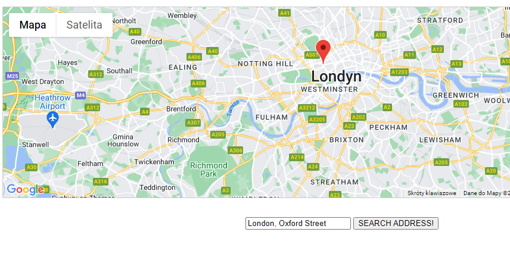

# Select & Share Place
> Small demo app for rendering a map with marked position of the requested address build with TS, 3rd party libraries and Google APIs.
> Live demo [_here_](https://noszczykmichal.github.io/select-share-place/index.html). 

## Table of Contents
* [General Info](#general-information)
* [Technologies Used](#technologies-used)
* [Screenshots](#screenshots)
* [Setup](#setup)
* [Project Status](#project-status)
* [Acknowledgements](#acknowledgements)
* [Contact](#contact)


## General Information
- This small app was build during course on Typescript.
- It allows to render a map with the requested address marked on it.
- Thanks to this project I've learnt how to work with 3rd party libraries in project build with Typescript.


## Technologies Used
- [Typescript](https://www.typescriptlang.org/)
- [Webpack](https://webpack.js.org/)
- [TS-loader](https://www.npmjs.com/package/ts-loader)
- [Axios](https://www.npmjs.com/package/axios)
- [ESLint](https://eslint.org/)


## Screenshots



## Setup
All dependencies can be found in package-lock.json in the repo's main directory.
Running this project locally:
```
# Clone this repository
$ git clone https://github.com/noszczykmichal/select-share-place
# Run `npm install` in your bash/command line
# Visit Google Maps Platform (https://console.cloud.google.com/google/maps-apis/start) and get your own API key (you will need a Google Account if you don't have one).
#Create a new project or add to an existing one access to below Google APIs:
- Geocoding API
- Maps Embed API
- Maps JavaScript API
- Places API
#Paste your own Google API key at the head section of the index.html and in app.ts
#Run `npm start` in your bash/command line
```

## Project Status
This project was build while I was doing course mentioned in [Acknowledgements](#acknowledgements). I'm not planning to develop it any further, yet in future I might use it as part of the bigger project. If you need a component like this one in your project feel free to use it!


## Acknowledgements
- This project was based on [Understanding TypeScript - 2022 Edition by Maximilian Schwarzmüller](https://www.udemy.com/course/understanding-typescript/).


## Contact
Created by [@noszczykmichal](https://noszczykmichal.github.io/portfolio/index.html#contact) - feel free to contact me!